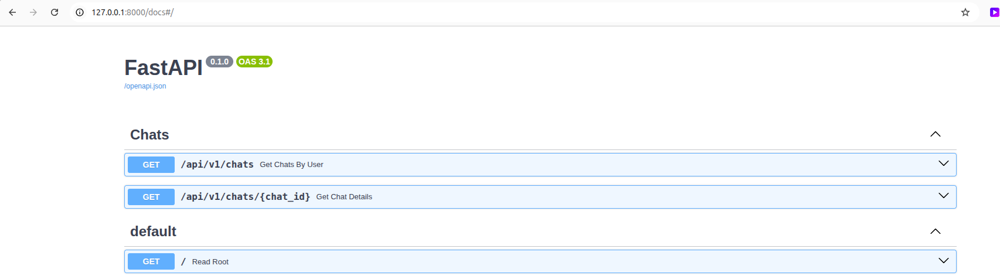

# GigaChat

Короткая инструкция по запуску на Linux (bash).

## Быстрый старт

```bash
# 1) Создать виртуальное окружение
python3 -m venv env

# 2) Активировать окружение
source env/bin/activate

# 3) Установить зависимости
pip install -r requirements.txt
```

## Запустить приложение bot


```bash
cd bot
python3 main.py
```


## Запускать backend 

```bash
cd backend
uvicorn app.main:app --reload
```

## Полезно знать
- Если команда `python3 -m venv` недоступна:
  ```bash
  sudo apt update && sudo apt install -y python3-venv
  ```
- Деактивировать окружение: `deactivate`.

